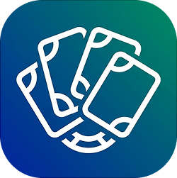

<h1>

Trading Card Album

</h1>

Colecciona, intercambia y comparte tarjetas.

Cada participante recibe una tarjeta asignada aleatoriamente y puede compartirla vía **QR**: al escanear el QR de otro participante se registra un contacto y se desbloquea su tarjeta en tu colección. Todo se sirve desde un único ejecutable.

## 🚀 Stack Tecnológico

El proyecto está diseñado como un monolito optimizado, con el frontend embebido en el binario del backend.

* **Backend:** Go 1.25 + Fiber v3.
* **Frontend:** Nuxt (Vue.js) compilado y embebido, servido por Go.
* **Base de Datos:** SQLite3 (embebida).
* **Estilos:** Tailwind CSS + tokens propios.

## 🤝 Cómo Contribuir

¡Las contribuciones son bienvenidas!

1. Lee nuestro **[Código de Conducta](CODE_OF_CONDUCT.md)** para asegurar un ambiente saludable.
2. Revisa la **[Guía de Contribución](CONTRIBUTING.md)** para entender el flujo de trabajo y los estándares.

## 📜 Licencia

Este proyecto es **Software Libre** bajo la licencia **GNU Affero General Public License v3.0 (AGPL-3.0)**.

> Tienes la libertad de usar, estudiar, compartir y modificar el software. Si modificas este software y lo ofreces como un servicio a través de una red (SaaS), **estás obligado a compartir el código fuente completo** de tu versión modificada bajo la misma licencia.

Consulta el archivo [LICENSE](LICENSE) para más detalles.

---

Hecho con ❤️ por el **GDG Guadalajara**.